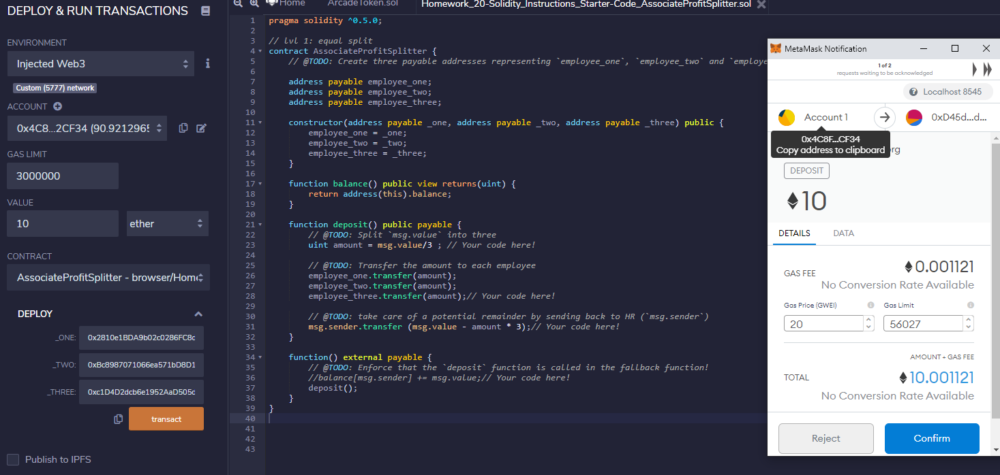
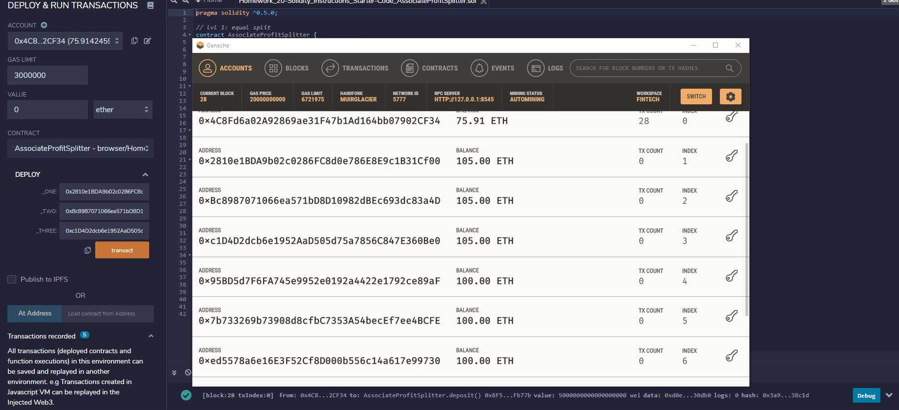
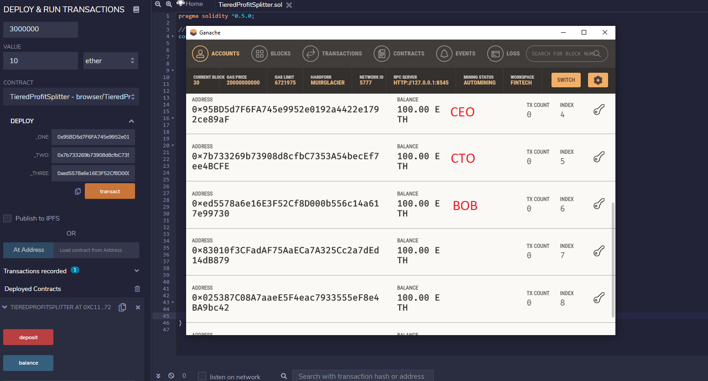
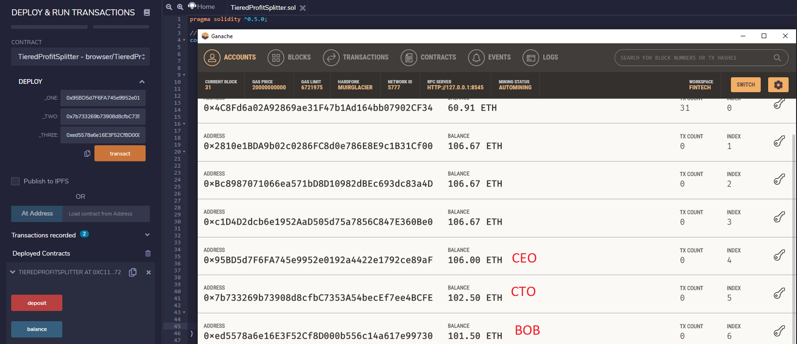
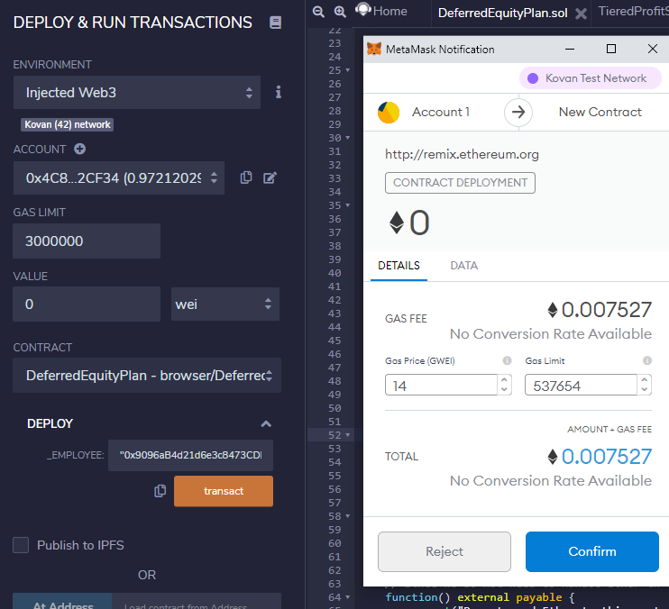
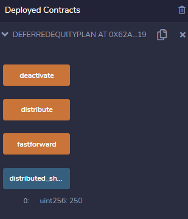

# Solidity

## Smart Contracts - Three Different Applications

In this file, I've created three different types of profitsplitter smart contracts, 

1. Associate Profit Splitter: Divides the profit equally between employees with remainder going back to the company
2. Tiered Profit Splitter: Distributes profits to different employee tiers (CEO, CTO, Bob)
3. Deferred Equity Plan: Distributes "deffered equity incentives" automatically. 

## Associate Profit Splitter Contract

In this contract, the user enters the wallet addresses of the employees as well as the profit in the value field. The value is then divided equally between employees, with any leftover wei going back to the Human Resources. 

In this screenshot, I am using my local network to send 10 ETH to 3 diff addresses . 

After clicking on the `deposit` function in the associateprofit contract, HR (wallet address with index 0) has successfully sent 3.33 ETH each to the 3 target addresses (address with index 1,2,3). See below sreenshot.

The whole process is also outlined here using a profit sample of 5 ETH  that was equally distributed to the 3 addresses (note that the starting and ending balance is different from the screenshots beforehand because of the transactions that happened in between):

--------------------------

## Tiered Profit Splitter Contract

In this contract, we do something similar to the above, but send profits to each employee based on tier or rank. These are our 3 employee tiers:

- CEO : Receives 60% of the profit. Employee address is Index 4
- CTO : Receives 25% of the profit. Employee address is Index 5
- Bob:  Recieves 15% of the profit. Employee address is Index 6

To do this, we divide the contract's value (profit) into 100 "points". Then we multiply the points by each employee's share.

Address amounts BEFORE tiered profit splitting:

Address amounts AFTER tiered profit splitting:

Finally, See GIF below on how the contract works based on a 10 ETH profit. Note that the contract was deployed in my local network. 

-----------------------------------------

## Deferred Equity Plan Contract

In this contract, we are distributing an employees' share over 4 years. The contract has 1000 shares and 250 shares are distributed every year. To prevent disbursement of too many shares, this account will require that the sender is HR and that the account is locked for 365 days after the shares are transferred to the employee. In other words, the employee can get the next round of shares only after 365 days up to the maximum number of shares allowed. 

For testing purposes, I used a `fastforward` function to be able to test the `distribute` function several times without locking the account. 

For this example, I used the Kovan ETH testnet to deploy my smart contract. We can see from below that both my Remix console and MetaMask extension are connected to the Kovan network. 

After runnning the `distribute` function, there are now 250 shares in the employees' wallet.

See GIF below for the whole contract process. Note that to run this on the Kovan testnetwork, you will need some test ETH.

